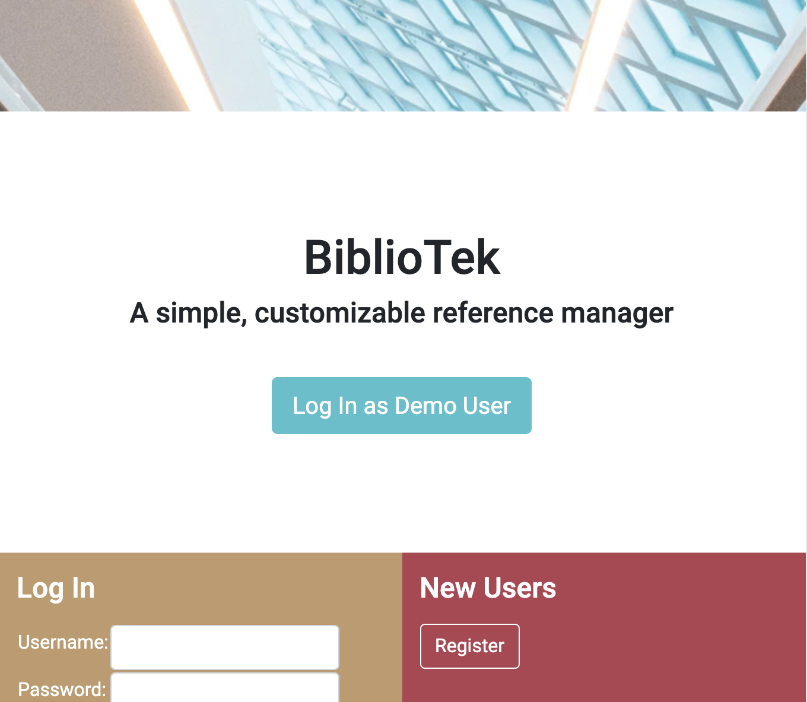
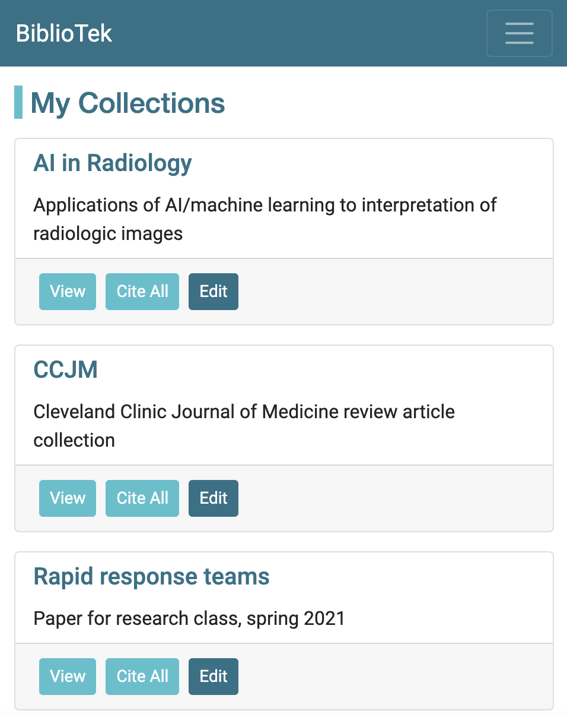
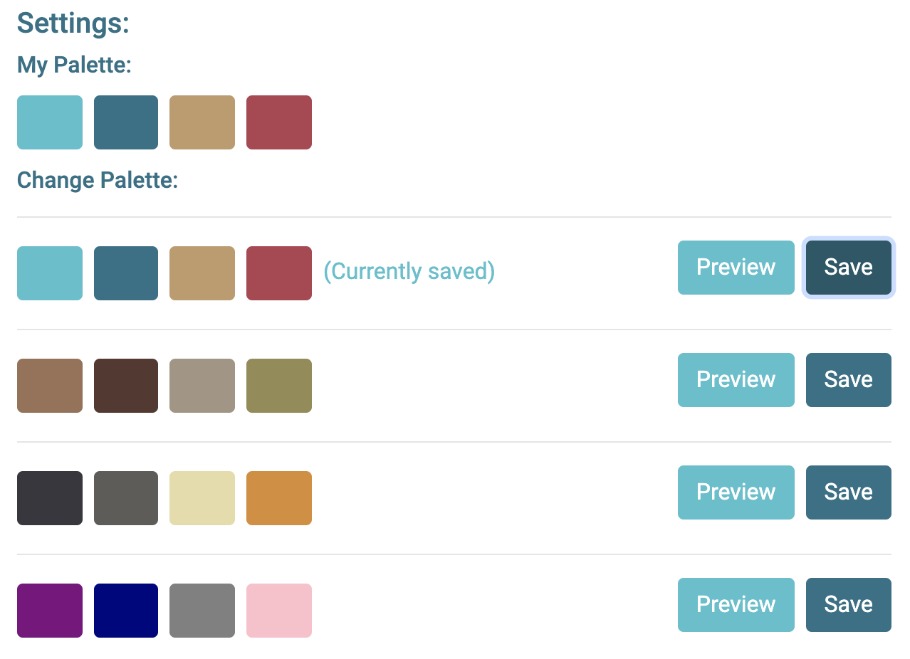
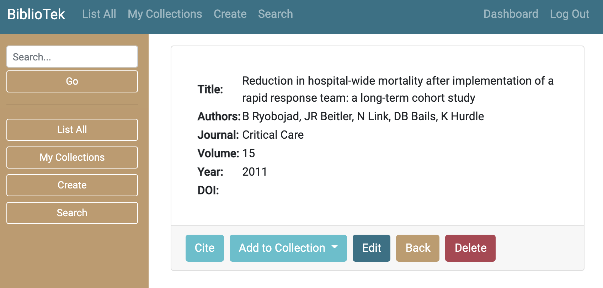
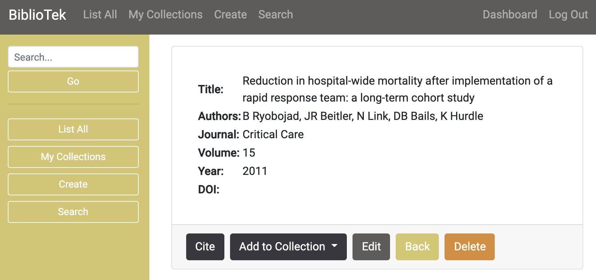
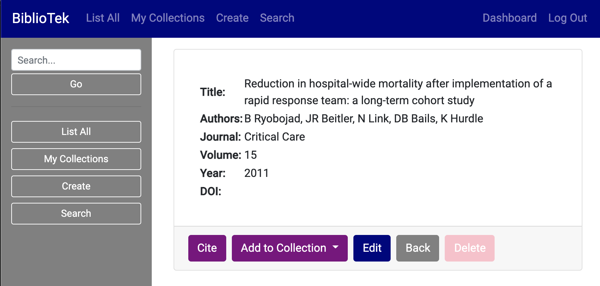
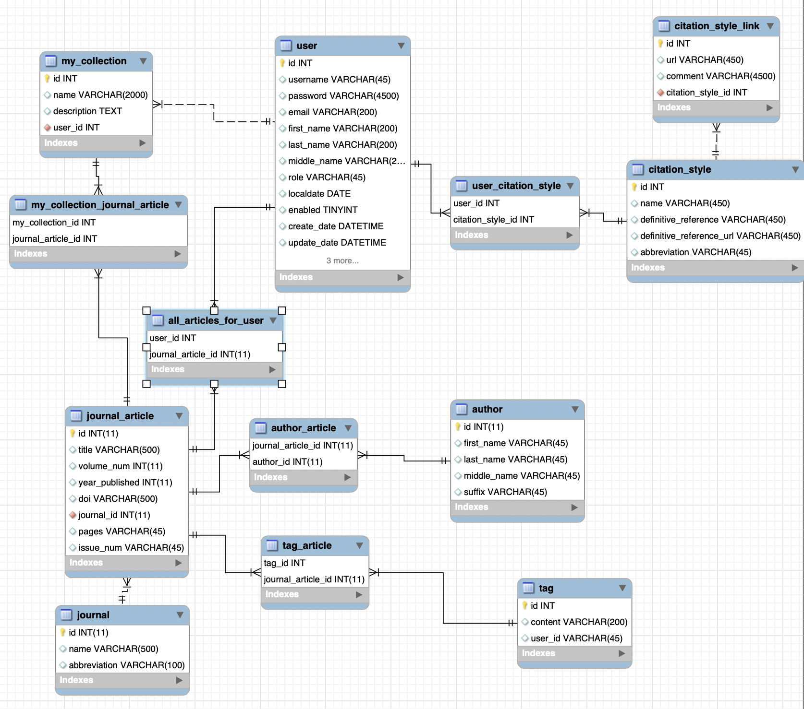

# BiblioTek



## Description
BiblioTek, in the vein of [Mendeley](https://www.mendeley.com/guides/desktop) or [EndNote](https://endnote.com/),
enables the user to manage references for academic papers. The user can enter bibliographic information about journal articles, save this information within their account, and generate citations formatted in a variety of citation styles.

## How to Access
Navigate to http://apps.ericpaulsondev.com:8080/BiblioTek.

## Features 

### Citation Formatting
For each journal article in a user's account, BiblioTek can generate citations based on rules for various citation standards:


### My Collections
#### A user can organize subsets of their journal article collection by theme:



### Customized Palettes
#### A user can choose a color theme for their UI.


#### Based on their selection, the site could look like:




#### Notes on implementation:
I used Sass to create palettes as maps of semantic descriptions and color selections, e.g. 

```scss
$palette-A-colors: (
  "primary": #4cc0cd,
  "primary-dark": #359ca7,
  "secondary": #287286,
  "secondary-dark": #1e5868,
  "warning": #c19a6b,
  "warning-dark": #a7855c,
  "danger": #b24251,
  "danger-dark": #8f3642
);
```
Then, I was able to iterate through a map of palettes:

```scss
$palettes: (
  "A": $palette-A-colors,
  "B": $palette-B-colors,
  "C": $palette-C-colors,
  "D": $palette-D-colors,
  "Y": $palette-Y-colors,
  "Z": $palette-Z-colors,
);
```

```scss
@each $key, $palette in $palettes {
  .navbar-palette-#{$key} {

    background-color: map-get($palette, "secondary");
  }

  .sidebar-palette-#{$key} {
    background-color: map-get($palette, "warning");
  }

// ...
```

In the Angular templates, I used the `[ngClass]` directive to dynamically bind the palette keys, e.g.:
```html
<div [ngClass]="'col-2 d-none d-md-block sidebar sidebar-palette' + this.chosenPalette">
```

Based on the `chosenPalette` variable I created in the component, Angular evaluates this expression to 
```html
<div class="col-2 d-none d-md-block sidebar sidebar-palette-A">
```

### Responsive Web Design

#### Documentation coming soon.

## Purpose
I am using this project as a prototype to practice full stack web development in a language- and framework-agnostic fashion. Academic citations lend themselves well to the create, read, update, delete (CRUD) operations that underlie most software. 

I have designed a REST API ([specification here](REST-API/REST-endpoints.md)), which will allow me to swap out different back and front end implementations as I learn new technologies.

### Implemented Technologies:
* Testing: JUnit, Jasmine, Postman
* Database: MySQL
* Object-relational mapping (ORM): Java Persistence API (JPA) implemented with Hibernate
* Back end: Java/Spring Boot
* Front end: TypeScript/Angular
* Styling: Bootstrap, Sass

### Coming Soon:
* Replace back end with Node.js
* Replace front end with React, jQuery, JSPs

## Database Layer
The database is implemented with MySQL, and developed with MySQL Workbench.

### Schema:


## REST API Endpoints
Described in detail [here](REST-API/REST-endpoints.md).

## Testing Frameworks
I have implemented testing with JUnit, Jasmine, and Postman. I'm planning on blogging about some lessons learned.

## In Progress
### Features In Progress
* Improve accessibility for users. Fulfill Web Content Accessibility Guidelines (WCAG).
* Improve UI for smaller screens and mobile devices.
* Add create/update/delete functionality for `Journal` entities.
* The user can interact with more information on their dashboard:
    * Updating registration details
    * Viewing the date they joined the site
    * Customizing citation style options
* The user can access a tutorial explaining site functionality.
* If the user has no articles, they are prompted with a tutorial option for adding articles.
* The user can copy their citations to the clipboard.
* Admins can access a separate admin dashboard.
* Improve existing color palette choices and add more.

### Fixes In Progress
* Fix UI for "edit" functionality.
* Improve confirmation messages for "create" and "edit" functionality.
* Deploy with HTTPS rather than HTTP.
* Find and fix bugs in citation formatting.
* Improve test coverage throughout.

### Planned Refactors
* Remove all references to old name ("RefTracker")
* Break down and modularize excessively long Angular components (e.g. `DisplayArticleComponent`'s template currently weighs in at 342 lines).